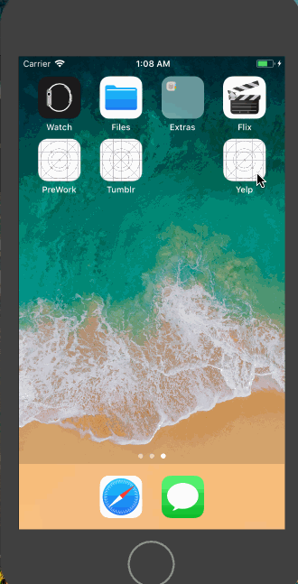
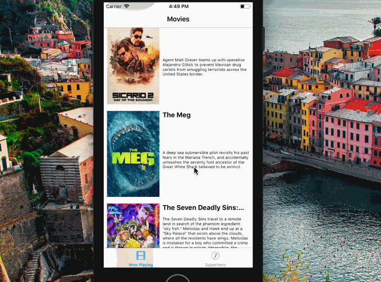

# Project 3 - Yelp 

**Yelp** is a Yelp search app using the [Yelp API](http://www.yelp.com/developers/documentation/v2/search_api).

Time spent: **1** hours spent in total

## User Stories

The following **required** functionality is completed:

- [x] Table rows for search results should be dynamic height according to the content height. (3pt)
- [x] Custom cells should have the proper Auto Layout constraints. (+5pt)
- [] Search bar should be in the navigation bar (doesn't have to expand to show location like the real Yelp app does). (+2pt)

The following **stretch** features are implemented:

- [ ] Infinite sApp Herecroll for restaurant results. (+3pt)
- [ ] Implement map view of restaurant results. (+3pt)
- [ ] Implement the restaurant detail page. (+2pt)

The following **additional** features are implemented:

- [ ] List anything else that you can get done to improve the app functionality!

Please list two areas of the assignment you'd like to **discuss further with your peers** during the next class (examples include better ways to implement something, how to extend your app in certain ways, etc):

1.
2.

## Video Walkthrough

GIF created with [LiceCap](http://www.cockos.com/licecap/).

## Notes

Describe any challenges encountered while building the app.

## License

    Copyright [2018] [Hamsika]

    Licensed under the Apache License, Version 2.0 (the "License");
    you may not use this file except in compliance with the License.
    You may obtain a copy of the License at

        http://www.apache.org/licenses/LICENSE-2.0

    Unless required by applicable law or agreed to in writing, software
    distributed under the License is distributed on an "AS IS" BASIS,
    WITHOUT WARRANTIES OR CONDITIONS OF ANY KIND, either express or implied.
    See the License for the specific language governing permissions and
    limitations under the License
    
    # Lab 3 - *Name of App Here*

**Yelp** is a movies app displaying box office and top rental DVDs using [The Movie Database API](http://docs.themoviedb.apiary.io/#).

Time spent: **X** hours spent in total

## User Stories

The following **required** user stories are complete:

- The following screens use AutoLayout to adapt to various orientations and screen sizes
   - [x] Movie feed view (+3pt)
   - [x] Detail view (+2pt)

The following **stretch** user stories are implemented:

- [ ] Dynamic Height Cells (+1)
- [ ] Collection View AutoLayout (+2)

The following **additional** user stories are implemented:

- [ ] List anything else that you can get done to improve the app functionality! (+1-3pts)

Please list two areas of the assignment you'd like to **discuss further with your peers** during the next class (examples include better ways to implement something, how to extend your app in certain ways, etc):

1.
2.

## Video Walkthrough

## Notes

Describe any challenges encountered while building the app.

## License

    Copyright [yyyy] [name of copyright owner]

    Licensed under the Apache License, Version 2.0 (the "License");
    you may not use this file except in compliance with the License.
    You may obtain a copy of the License at

        http://www.apache.org/licenses/LICENSE-2.0

    Unless required by applicable law or agreed to in writing, software
    distributed under the License is distributed on an "AS IS" BASIS,
    WITHOUT WARRANTIES OR CONDITIONS OF ANY KIND, either express or implied.
    See the License for the specific language governing permissions and
    limitations under the License.
